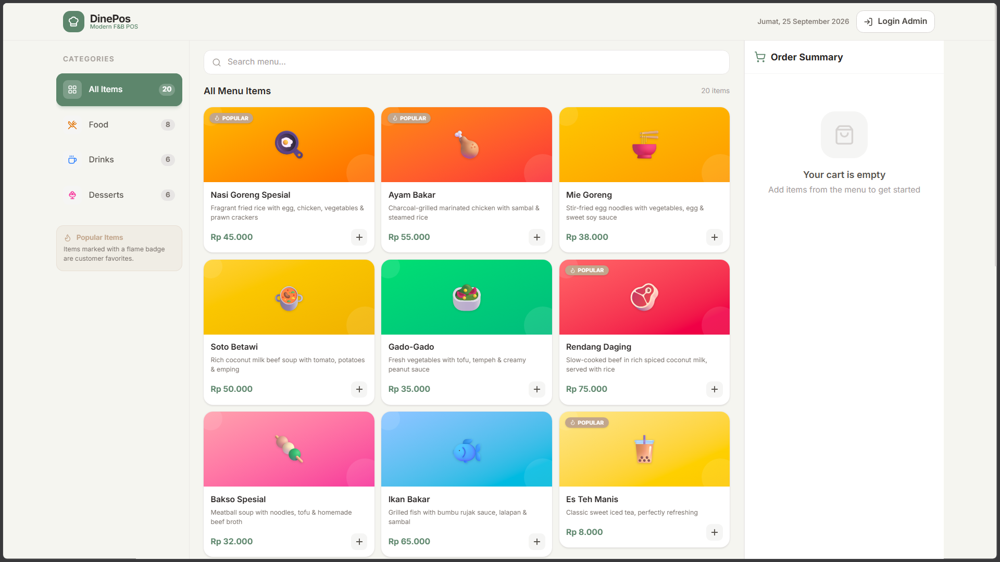
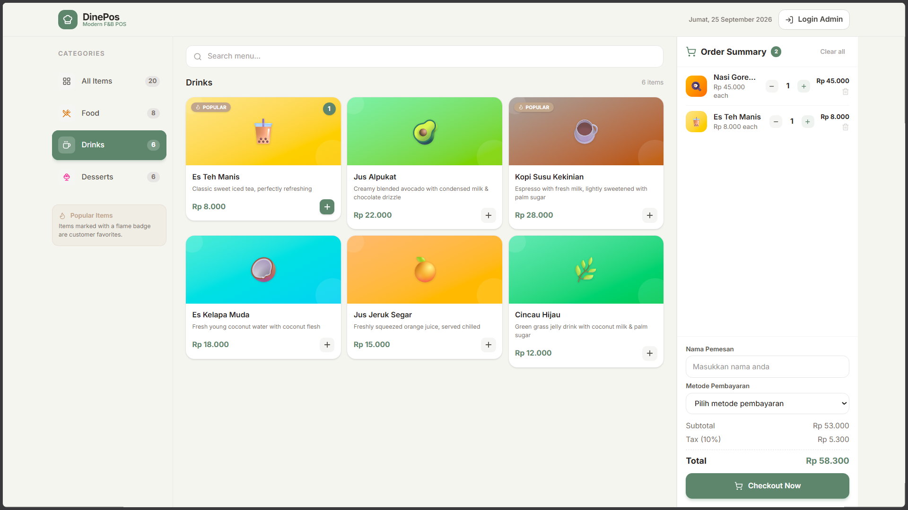
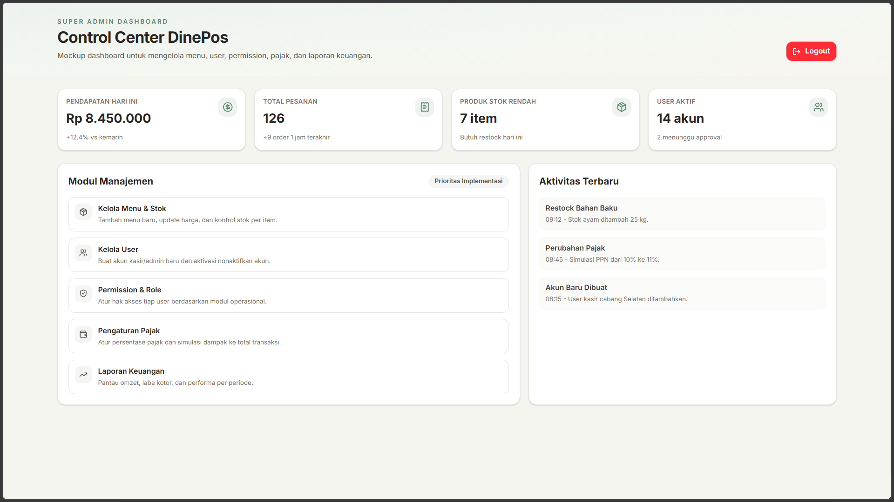

# DinePos

DinePos adalah aplikasi **Point of Sale (POS) untuk bisnis Food & Beverage** yang dibuat dengan Next.js. Aplikasi ini menyediakan katalog menu, pemilihan kategori, keranjang pesanan, checkout dengan Midtrans Snap, serta halaman login dan dashboard untuk kebutuhan administrasi.

## Preview UI

### Halaman Kasir



Tampilan utama kasir dengan kategori menu, pencarian, kartu produk, dan ringkasan pesanan. Sumber gambar: screenshot UI project ini, [`preview/menu-1.png`](./preview/menu-1.png).

### Menu dan Keranjang



Preview interaksi katalog menu dan keranjang pesanan. Sumber gambar: screenshot UI project ini, [`preview/menu-2.png`](./preview/menu-2.png).

### Dashboard Admin



Dashboard admin berisi ringkasan pendapatan, jumlah pesanan, stok rendah, user aktif, modul manajemen, dan aktivitas terbaru. Sumber gambar: screenshot UI project ini, [`preview/dashboard.png`](./preview/dashboard.png).

## Fitur

- Menampilkan menu berdasarkan kategori: makanan, minuman, dan dessert.
- Mencari menu dan menambahkan item ke keranjang.
- Mengatur jumlah item dan menghitung subtotal pesanan.
- Checkout melalui Midtrans Snap, dengan mode demo jika server key belum diatur.
- Menerima notifikasi status pembayaran melalui webhook Midtrans.
- Login admin dengan validasi form dan redirect ke dashboard.
- Dashboard admin untuk preview pengelolaan menu, user, role, pajak, stok, dan laporan.
- Layout responsif untuk desktop dan perangkat mobile.
- Pembuatan receipt setelah checkout menggunakan jsPDF.

## Teknologi

- [Next.js 16](https://nextjs.org/) dengan App Router
- React 19 dan TypeScript
- Tailwind CSS 4
- Zustand untuk state keranjang
- Framer Motion untuk animasi UI
- Lucide React untuk ikon
- Midtrans Snap untuk pembayaran
- jsPDF untuk receipt

## Struktur Route

| Route | Keterangan |
| --- | --- |
| `/` | Halaman kasir dan katalog menu |
| `/auth` | Halaman login admin |
| `/admin/dashboard` | Dashboard admin |
| `/api/menu` | API GET untuk mengambil data menu |
| `/api/checkout` | API POST untuk membuat transaksi Midtrans |
| `/api/payment/notification` | Webhook notifikasi status pembayaran |

## Menjalankan Project

### Persyaratan

- Node.js 20 atau versi yang lebih baru
- npm
- Akun Midtrans, jika ingin mengaktifkan pembayaran sungguhan

### Instalasi

```bash
npm install
npm run dev
```

Buka [http://localhost:3000](http://localhost:3000) di browser.

Untuk production:

```bash
npm run build
npm run start
```

## Konfigurasi Midtrans

Buat file `.env.local` di root project:

```env
NEXT_PUBLIC_MIDTRANS_CLIENT_KEY=your_midtrans_client_key
MIDTRANS_SERVER_KEY=your_midtrans_server_key
```

Tanpa `MIDTRANS_SERVER_KEY`, endpoint checkout akan berjalan dalam mode demo dan tidak membuat transaksi pembayaran sungguhan. Environment development menggunakan endpoint sandbox Midtrans, sedangkan production menggunakan endpoint production.

Setelah deploy, arahkan HTTP notification URL Midtrans ke:

```text
https://your-domain.com/api/payment/notification
```

## Perintah yang Tersedia

```bash
npm run dev      # Menjalankan server development
npm run build    # Membuat build production
npm run start    # Menjalankan build production
npm run lint     # Menjalankan ESLint
```

## Catatan Pengembangan

- Data menu saat ini berasal dari mock data di [`lib/menu-data.ts`](./lib/menu-data.ts).
- Login admin masih bersifat frontend-only untuk kebutuhan demo.
- Dashboard admin masih berupa mockup; modul manajemen pada dashboard belum terhubung ke database.
- Status pembayaran sudah diverifikasi menggunakan signature Midtrans, tetapi persistensi order masih perlu dihubungkan ke database.

## Lisensi

Project ini bersifat privat dan digunakan untuk kebutuhan pengembangan internal.
